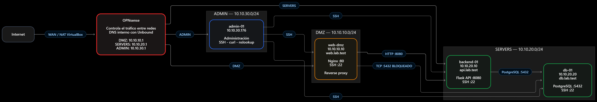
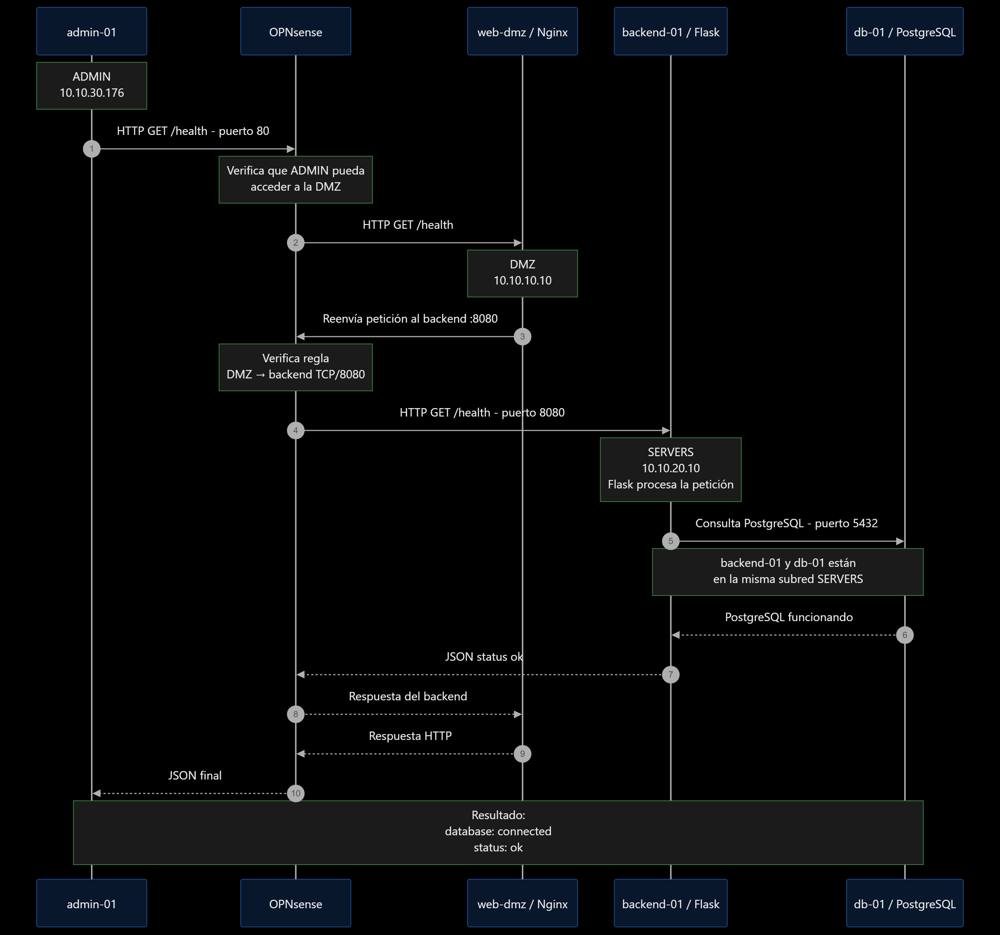

# Laboratorio de red empresarial

Una aplicación web interna necesita separar la entrada HTTP, la API, los datos y la administración. Este laboratorio reproduce esa arquitectura con **cinco máquinas virtuales** en VirtualBox y tres zonas filtradas por `fw-opnsense`.

## Arquitectura

[Abrir la topología en tamaño completo](diagramas/topologia-principal.png)

`fw-opnsense` enruta y filtra entre **ADMIN** (`10.10.30.0/24`), **DMZ** (`10.10.10.0/24`) y **SERVERS** (`10.10.20.0/24`). Unbound figura como DNS interno en la configuración declarada. `backend-01` y `db-01` comparten SERVERS: su conexión **no atraviesa `fw-opnsense`**. La WAN usa NAT de VirtualBox. No hay publicación WAN declarada; falta la exportación de esa configuración.

| VM | Dirección | Función |
|---|---|---|
| `fw-opnsense` | `10.10.10.1` / `10.10.20.1` / `10.10.30.1` | Enrutamiento, reglas entre zonas y DNS. |
| `admin-01` | `10.10.30.176` observado por DHCP | Administración SSH y pruebas HTTP/DNS. |
| `web-dmz` | `10.10.10.10` · `web.lab.test` | Nginx recibe HTTP en `:80` y reenvía al backend. |
| `backend-01` | `10.10.20.10` · `api.lab.test` | Flask atiende `/health` en `:8080` cuando está levantado. |
| `db-01` | `10.10.20.20` · `db.lab.test` | PostgreSQL 18 escucha en `10.10.20.20:5432`. |

[Diagramas y notas de lectura](diagramas/README.md)

Ver el flujo de /health

En esta imagen, `fw-opnsense` representa el paso por el firewall; los extremos HTTP son `admin-01`, Nginx y Flask.

## Una petición de extremo a extremo

Desde `admin-01`, `GET http://10.10.10.10/health` llega a Nginx, pasa a Flask y consulta PostgreSQL. La [captura del recorrido completo](evidencias/dia-05/flujo-completo-nginx-api-postgresql.png) muestra `database: connected` y `status: ok`. La petición se probó **por IP**; los nombres `*.lab.test` se comprobaron por separado.

## Controles y pruebas

| Control | Resultado observado | Evidencia |
|---|---|---|
| DMZ sin acceso directo a PostgreSQL | La conexión de `web-dmz` a `db-01:5432` agotó el tiempo de espera. | [Intento desde DMZ](evidencias/dia-06/dmz-a-postgresql-bloqueado.png) |
| Separación de ADMIN | ICMP desde `web-dmz` y `backend-01` hacia `10.10.30.1` sin respuesta; falta probar TCP hacia un host de ADMIN. | [DMZ](evidencias/dia-04/web-dmz-pruebas-bloqueadas.png) · [SERVERS](evidencias/dia-04/backend-01-pruebas-de-segmentacion.png) |
| Rechazo de contraseña SSH | El intento forzado terminó en `Permission denied (publickey)` en los tres servidores. | [web-dmz](evidencias/dia-06/web-dmz-ssh-solo-clave.png) · [backend-01](evidencias/dia-06/backend-01-ssh-solo-clave.png) · [db-01](evidencias/dia-06/db-01-ssh-solo-clave.png) |
| PostgreSQL ligado a su IP privada | `ss` muestra `10.10.20.20:5432`, no escucha en todas las interfaces. | [Sockets de db-01](evidencias/dia-06/db-01-servicios-en-escucha.png) |
| Nombres internos | `getent` devolvió las IP esperadas de `web.lab.test`, `api.lab.test` y `db.lab.test`. | [Resolución desde ADMIN](evidencias/dia-06/dns-interno-lab-test.png) |

Las pruebas son puntuales: el timeout no identifica una regla y faltan exportaciones efectivas de `fw-opnsense`, SSH y `pg_hba.conf`. La [matriz](documentacion/plan-de-pruebas.md) distingue lo observado de lo pendiente.

## Estado actual

El acceso web usa HTTP sin TLS y Flask se ejecutó con su servidor de desarrollo; el código de aplicación no está versionado. **No implementado:** HTTPS, un servicio persistente para Flask y una subred separada para `db-01`.

[Diagramas](diagramas/README.md) · [Arquitectura](documentacion/arquitectura.md) · [Plan de red](documentacion/plan-de-red.md) · [Reglas de firewall](documentacion/reglas-de-firewall.md) · [Evidencias](evidencias/README.md) · [Diagnóstico](documentacion/diagnostico.md) · [Configuraciones de referencia](configuraciones/README.md)
