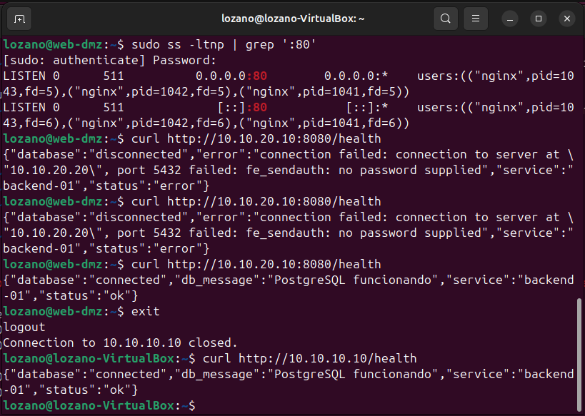
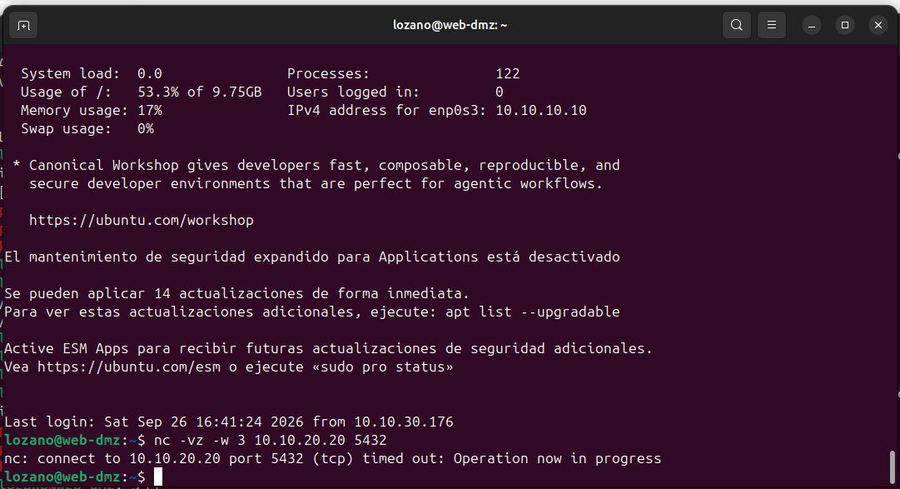

# Enterprise Network Lab

Este laboratorio reproduce una infraestructura empresarial pequeña y segmentada dentro de VirtualBox. Cinco máquinas virtuales separan administración, entrada HTTP, lógica de aplicación y base de datos, con OPNsense como router y firewall entre zonas.

El recorrido probado es **ADMIN → Nginx en DMZ → Flask en SERVERS → PostgreSQL**. La documentación explica qué tráfico se permite, dónde se aplica cada control y qué demuestran las pruebas positivas y negativas. Es un entorno de aprendizaje; no está preparado para producción.

[Arquitectura](docs/architecture.md) · [Plan de red](docs/network-plan.md) · [Firewall](docs/firewall-rules.md) · [Pruebas](docs/test-plan.md) · [Diagnóstico](docs/troubleshooting.md) · [Evidencias](evidence/README.md) · [Configuraciones](configs/README.md)

## Objetivos

- Entender routing y segmentación entre zonas con distintas responsabilidades.
- Aplicar mínimo privilegio y comprobar tanto los accesos necesarios como los bloqueos.
- Administrar Linux mediante SSH con claves y resolver nombres internos con DNS.
- Integrar un reverse proxy, una API y una base de datos sin dar a la DMZ acceso directo a los datos.
- Documentar decisiones, límites y resultados que otra persona pueda revisar.

## Arquitectura

OPNsense conecta las redes DMZ, SERVERS y ADMIN y sale a Internet por NAT de VirtualBox. `web-dmz` recibe HTTP y lo reenvía al backend; sólo el backend consulta PostgreSQL. `admin-01` es la estación de administración y el cliente utilizado en las pruebas.

**Límite importante:** `backend-01` y `db-01` comparten `10.10.20.0/24`. Su tráfico es local a SERVERS y no pasa por OPNsense. La restricción de acceso a PostgreSQL depende también de su dirección de escucha, `pg_hba.conf` y la autenticación SCRAM.

## Topología

Esquema temporal; el diagrama final se incorporará en [diagrams/](diagrams/README.md).

```text
Internet
   |
NAT de VirtualBox
   |
fw-opnsense
   +-- DMZ     10.10.10.0/24 -- web-dmz    10.10.10.10
   +-- SERVERS 10.10.20.0/24 -- backend-01 10.10.20.10
   |                       +-- db-01      10.10.20.20
   +-- ADMIN   10.10.30.0/24 -- admin-01   DHCP

Petición de prueba:
admin-01 --HTTP:80--> web-dmz --HTTP:8080--> backend-01 --TCP:5432--> db-01
            OPNsense             OPNsense                misma subred
```

## Segmentación de red

| Zona | Subred | Gateway | Hosts principales | Función |
|---|---|---|---|---|
| WAN | NAT de VirtualBox; dirección por DHCP | Proporcionado por VirtualBox | fw-opnsense | Salida del laboratorio a Internet |
| DMZ | 10.10.10.0/24 | 10.10.10.1 | web-dmz | Entrada HTTP y reverse proxy |
| SERVERS | 10.10.20.0/24 | 10.10.20.1 | backend-01, db-01 | Aplicación y persistencia |
| ADMIN | 10.10.30.0/24 | 10.10.30.1 | admin-01 | Administración y pruebas |

`admin-01` aparece con `10.10.30.176` por DHCP en las capturas. Es una dirección observada, no una IP fija garantizada. El [plan de red](docs/network-plan.md) detalla interfaces y puertos.

## Componentes

| Componente | Sistema / servicio | Responsabilidad |
|---|---|---|
| fw-opnsense | OPNsense, Unbound | Routing entre zonas, filtrado y resolución DNS interna |
| admin-01 | Ubuntu Desktop | SSH, navegador, consultas DNS y pruebas con curl |
| web-dmz | Ubuntu Server, Nginx | Recibir HTTP en TCP/80 y reenviarlo a backend-01:8080 |
| backend-01 | Ubuntu Server, Python/Flask, psycopg | Atender `/health` en TCP/8080 y consultar PostgreSQL |
| db-01 | Ubuntu Server, PostgreSQL 18 | Base `labd`, usuario de aplicación `labapp` y tabla `healthcheck` |

## Flujo de una petición

1. Desde `admin-01` se solicita `http://web.lab.test/health`.
2. OPNsense permite el acceso de ADMIN a `web-dmz:80`.
3. Nginx reenvía la petición a `10.10.20.10:8080`, atravesando el firewall entre DMZ y SERVERS.
4. Flask se conecta con psycopg a `10.10.20.20:5432` y consulta `healthcheck` en `labd`.
5. Flask construye la respuesta JSON y Nginx la devuelve al cliente.

Nginx no se comunica directamente con PostgreSQL. La prueba completa del día 5 utilizó las IP; el día 6 se verificó la resolución de los nombres actuales.

## Política de firewall

El criterio es permitir las comunicaciones necesarias y bloquear el resto por defecto (*default deny*).

| Origen | Destino | Política relevante |
|---|---|---|
| ADMIN | Servidores | SSH TCP/22 para administrar; HTTP TCP/80 hacia web-dmz |
| ADMIN | fw-opnsense | Acceso administrativo y DNS interno |
| web-dmz | backend-01 | PASS TCP/8080 para el reverse proxy |
| DMZ | db-01 y ADMIN | BLOCK del acceso directo a PostgreSQL y del acceso a la zona administrativa |
| DMZ | SERVERS | BLOCK salvo las excepciones necesarias, como backend-01:8080 |
| SERVERS | ADMIN | BLOCK de nuevas conexiones no autorizadas |
| DMZ / SERVERS | Servicios externos necesarios | Salida limitada según las excepciones documentadas por zona |
| WAN | Aplicación | Sin reglas manuales de entrada ni port forwards |

La [política detallada](docs/firewall-rules.md) distingue configuración confirmada, alcance de las capturas y comprobaciones pendientes. No se dispone de una exportación de reglas para auditar su orden y todos sus destinos.

## Seguridad implementada

- Segmentación de ADMIN, DMZ y SERVERS con bloqueo por defecto entre zonas.
- Aislamiento de la DMZ: puede consultar la API, pero no PostgreSQL directamente.
- Clave ED25519 de `admin-01`, con la clave pública instalada en los tres servidores.
- SSH con `PubkeyAuthentication yes`, `PasswordAuthentication no` y `KbdInteractiveAuthentication no`; se probó el rechazo de contraseña en los tres hosts.
- PostgreSQL escucha en `10.10.20.20:5432`. La política de `pg_hba.conf` limita `labd`/`labapp` a `10.10.20.10/32` con SCRAM.
- DNS interno en Unbound para nombrar los servicios; la resolución de un nombre no concede acceso al servicio.
- Aplicación sin publicación por WAN.

Los controles de PostgreSQL complementan al firewall: estar en SERVERS no equivale a tener autorización para usar la base. Los [ejemplos de configuración](configs/README.md) no contienen credenciales.

## DNS interno

| Nombre | Dirección | Servicio |
|---|---|---|
| web.lab.test | 10.10.10.10 | Entrada HTTP |
| api.lab.test | 10.10.20.10 | API interna |
| db.lab.test | 10.10.20.20 | PostgreSQL |

Los tres nombres se resolvieron desde `admin-01` mediante `getent hosts`. El diagnóstico del sufijo usado inicialmente y la elección de `lab.test` se explican en [troubleshooting](docs/troubleshooting.md).

## Aplicación de prueba

`GET /health` comprueba una dependencia real: Flask consulta PostgreSQL y devuelve el mensaje almacenado en `healthcheck`.

```json
{
  "database": "connected",
  "db_message": "PostgreSQL funcionando",
  "service": "backend-01",
  "status": "ok"
}
```

Esta respuesta permite verificar proxy, API y acceso a datos en una sola petición. No equivale a probar todas las operaciones de una aplicación. El repositorio conserva las evidencias y ejemplos de configuración; el código de Flask y un despliegue automatizado todavía no están versionados.

## Validación

Resultados de las sesiones registradas, sin volver a conectarse a las VMs durante esta revisión documental:

| Prueba | Origen | Destino | Resultado observado |
|---|---|---|---|
| HTTP y flujo completo | admin-01 | web-dmz:80 → API → DB | JSON con `database: connected` y `status: ok` |
| Administración SSH | admin-01 | Los tres servidores:22 | Sesiones establecidas |
| Acceso a API | web-dmz | backend-01:8080 | `/health` responde con la DB conectada |
| Consulta SQL | backend-01 | db-01:5432 | `SELECT` devuelve el mensaje de `healthcheck` |
| Acceso directo a DB | web-dmz | db-01:5432 | Timeout, coherente con el bloqueo configurado |
| Aislamiento de ADMIN | web-dmz y backend-01 | 10.10.30.1, ICMP | Sin respuesta; la captura cubre ese destino y protocolo |
| DNS interno | admin-01 | Tres nombres `*.lab.test` | IP esperada para cada nombre |
| SSH por contraseña | admin-01 | Los tres servidores:22 | `Permission denied (publickey)` |
| Escucha PostgreSQL | db-01 | Sockets locales | Sólo `10.10.20.20:5432` en la captura |

Una prueba negativa es parte de la validación de seguridad. Un timeout aislado no demuestra la causa: debe contrastarse con disponibilidad del destino y registros del firewall. La [matriz de pruebas](docs/test-plan.md) contiene los IDs, comandos, evidencias y límites de cada conclusión.

## Evidencias

El [índice de evidencias](evidence/README.md) recorre los días [2](evidence/day-02/), [3](evidence/day-03/), [4](evidence/day-04/), [5](evidence/day-05/) y [6](evidence/day-06/). Se conservan las capturas originales, incluidos los intentos previos que ayudan a entender el diagnóstico.

**Flujo completo desde ADMIN a través de Nginx y Flask hasta PostgreSQL:**



**Prueba negativa del acceso directo desde la DMZ a PostgreSQL:**



## Decisiones técnicas

| Decisión | Motivo y alcance |
|---|---|
| DMZ separada | Limitar las comunicaciones de la capa que recibe HTTP y proteger ADMIN y los datos |
| Nginx delante de Flask | Separar el punto de entrada de la lógica de aplicación; el recorrido normal entra por TCP/80 |
| Backend interno | No publicarlo por WAN; permitir el acceso necesario del proxy y las excepciones administrativas de prueba |
| PostgreSQL restringido | Compensar que backend y DB comparten subred con controles en el propio servicio |
| SSH mediante claves | Evitar la autenticación remota por contraseña y verificar su rechazo explícitamente |
| DNS interno | Administrar servicios por nombres estables en lugar de memorizar direcciones |

## Limitaciones actuales

- Backend y DB comparten SERVERS; OPNsense no inspecciona ese tramo. No hay una subred de datos independiente ni un firewall de host adicional documentado.
- Flask usa su servidor de desarrollo y sólo escucha en 8080 mientras la aplicación está levantada; no hay una unidad systemd del backend documentada.
- El flujo HTTP no tiene TLS. La sesión `psql` capturada negoció TLS, pero eso no demuestra que la aplicación lo exija ni que valide el certificado de la DB.
- Durante el diagnóstico, `/health` devolvió detalles internos de conexión en los errores. Falta separar el mensaje al cliente del detalle que se conserva en logs.
- Todas las VMs dependen del mismo host VirtualBox; no hay alta disponibilidad.
- No hay observabilidad centralizada ni un procedimiento de backup/restauración demostrado.
- La evidencia de filtrado es puntual e IPv4; no constituye una auditoría exhaustiva de reglas o de IPv6. Faltan capturas independientes de sockets de backend y DB del día 6.

## Mejoras futuras

1. Completar el diagrama y las evidencias pendientes; versionar código y configuraciones efectivas sanitizadas.
2. Ejecutar Flask con Gunicorn y systemd, y añadir HTTPS al acceso web.
3. Separar DB en otra subred y evaluar un firewall de host adicional, por ejemplo UFW.
4. Añadir métricas, monitorización, logs centralizados y pruebas de backup/restauración de PostgreSQL.
5. Automatizar configuración con Ansible y evaluar Terraform si la plataforma lo justifica. Docker o Kubernetes serían etapas posteriores, todavía no implementadas.

## Aprendizajes

El recorrido de un paquete determina qué control puede protegerlo: una regla en OPNsense no filtra dos hosts que hablan dentro de la misma subred. También fue necesario distinguir errores de routing, puertos sin servicio, fallos DNS y rechazos de autenticación. Verificar la configuración efectiva de SSH y probar caminos prohibidos resultó tan importante como obtener una respuesta correcta de `/health`.
